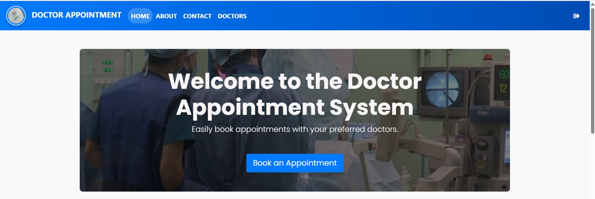

# 🩺 Doctor Appointment System

<div align="center">

## 📅 Smart Healthcare Appointment Management System

A web-based application designed to simplify doctor appointment booking and healthcare management.

<br>

[](https://www.python.org/)
[](https://www.djangoproject.com/)
[](https://developer.mozilla.org/en-US/docs/Web/HTML)
[](https://developer.mozilla.org/en-US/docs/Web/CSS)
[](https://getbootstrap.com/)
[](https://github.com/rihhanna)

</div>

---

# 📌 Project Overview

The **Doctor Appointment System** is a healthcare management web application developed using **Django**. The system allows patients to book appointments online, manage healthcare scheduling, and improve communication between doctors and patients.

This project was created as part of my learning journey in **full-stack web development** and backend application design.

---

# 🎯 Project Objectives

✔ Simplify appointment booking process  
✔ Provide organized patient scheduling  
✔ Improve healthcare service accessibility  
✔ Practice Django backend development  
✔ Build responsive and user-friendly interfaces  

---

# ✨ Key Features

| Feature | Description |
|---------|-------------|
| 🩺 Doctor Management | View available doctors |
| 📅 Appointment Booking | Schedule doctor appointments |
| 👤 Patient Registration | Register and manage patients |
| 🔐 Authentication System | Secure login and registration |
| 📱 Responsive Design | Mobile-friendly interface |
| 🏥 Healthcare Dashboard | Manage healthcare operations |
| 📋 Appointment Tracking | Track scheduled appointments |

---

# 🛠️ Technologies Used

| Technology | Purpose |
|------------|---------|
| **Python** | Backend programming |
| **Django** | Web framework |
| **HTML5** | Page structure |
| **CSS3** | Styling |
| **Bootstrap** | Responsive UI |
| **SQLite** | Database |
| **Git & GitHub** | Version control |

---

# 📂 Project Structure

```bash
Doctor-Appointment-Systemm/
│
├── 📁 Doctor/
├── 📁 project/
├── 📁 static/
├── 📁 templates/
│
├── 📄 manage.py
├── 📄 requirements.txt
├── 📄 Procfile
├── 📄 .gitignore
└── 📄 README.md
```

---

# 🚀 Installation & Setup

## 📌 Prerequisites

Before running the project, install:

- Python 3.x
- pip
- Git (optional)

---

# ⚙️ Run Locally

```bash
# Clone repository
git clone https://github.com/rihhanna/Doctor-Appointment-Systemm.git

# Navigate to project folder
cd Doctor-Appointment-Systemm

# Create virtual environment
python -m venv venv

# Activate virtual environment

# Windows
venv\Scripts\activate

# Mac/Linux
source venv/bin/activate

# Install dependencies
pip install -r requirements.txt

# Run migrations
python manage.py migrate

# Start development server
python manage.py runserver
```

---

# 🌐 Open Application

```text
http://127.0.0.1:8000
```

---

# 📸 Screenshots

## 🏠 Home Page

Add your homepage screenshot here:

```markdown

```

---

## 📅 Appointment Booking Page

```markdown

```

---

# 💡 Learning Outcomes

Through this project, I learned:

- Django project structure
- Backend development fundamentals
- Database integration using SQLite
- User authentication concepts
- Responsive frontend development
- Managing templates and static files
- Deploying Django applications

---

# 📊 Future Improvements

🚀 Add email notifications  
🚀 Add doctor availability calendar  
🚀 Add patient medical history system  
🚀 Improve dashboard analytics  
🚀 Add online consultation support  
🚀 Deploy full production version  

---

# 👩‍💻 Author

## Rehana Hassan Muhumed

| Information | Details |
|------------|---------|
| 🎓 Field | Software Engineering |
| 💻 Focus | Full-Stack Development & Data Analytics |
| 🌍 Location | Somaliland |
| 🔗 GitHub | https://github.com/rihhanna |
| 📫 Email | hrihhana@gmail.com |

---

# 🏆 Project Highlights

✅ Full-stack healthcare web application  
✅ Built using Django framework  
✅ Responsive UI design  
✅ Real-world healthcare management concept  
✅ Early portfolio project demonstrating backend skills  

---

# 📚 Related Projects

| Project | Description |
|---------|-------------|
| 📚 Online Bookstore | Django e-commerce project |
| 📊 Customer Segmentation Dashboard | Data analytics dashboard |
| 📈 Churn Analysis Dashboard | Power BI analytics project |
| 🌱 Crop IQ | Smart agriculture solution |

---

# 🙏 Acknowledgments

Special thanks to:

- Django Documentation
- Open Source Community
- Bootstrap Framework
- Everyone who supported my learning journey

---

# ⭐ Support

If you found this project useful:

- ⭐ Star the repository
- 🍴 Fork the project
- 🔗 Share with others
- 💬 Give feedback

---

<div align="center">

# ❤️ Built with Passion by Rehana Hassan Muhumed

### “Technology for improving healthcare accessibility.”

</div>
